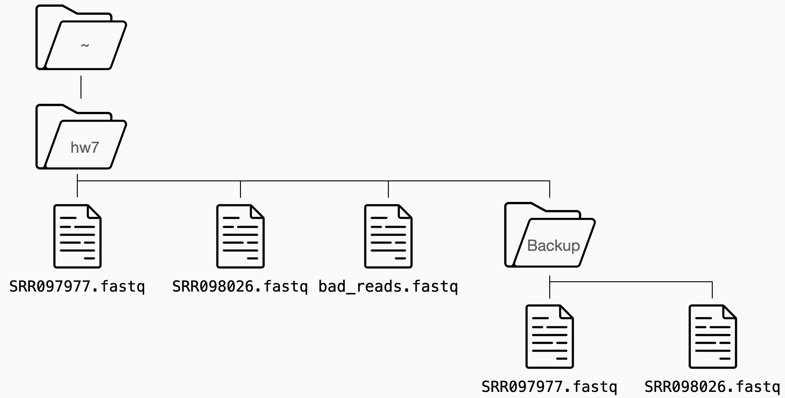

View this [Redirection video](https://youtu.be/ME8hsYPhCeQ) and replicate the file structure shown below on the Hood cluster. This [cheat sheet](https://github.com/RehanSaeed/Bash-Cheat-Sheet) with the bash commands we covered in lab might also be helpful.

* Create `bad_reads.fastq` the same as discussed in the [Redirection video](https://youtu.be/ME8hsYPhCeQ).
* Permissions of files in the `Backup` directory should be read only.
* The permissions on your files should be world readable so I can see them.
* Submit the full path to your copy of `hw7` on the cluster.

